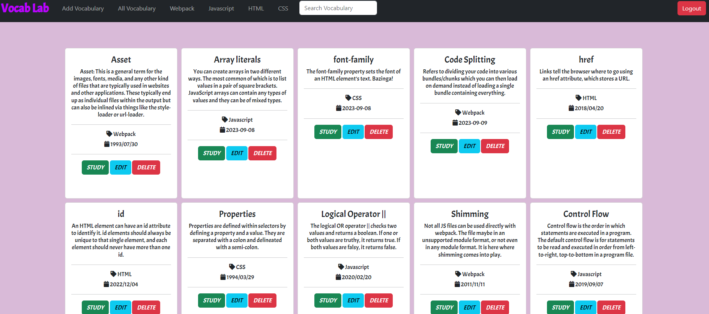
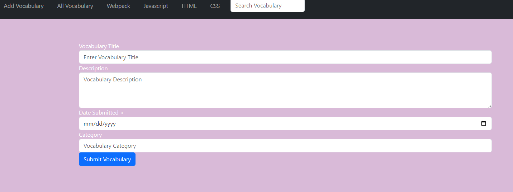
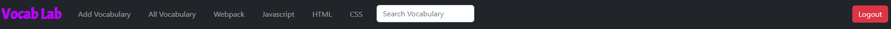
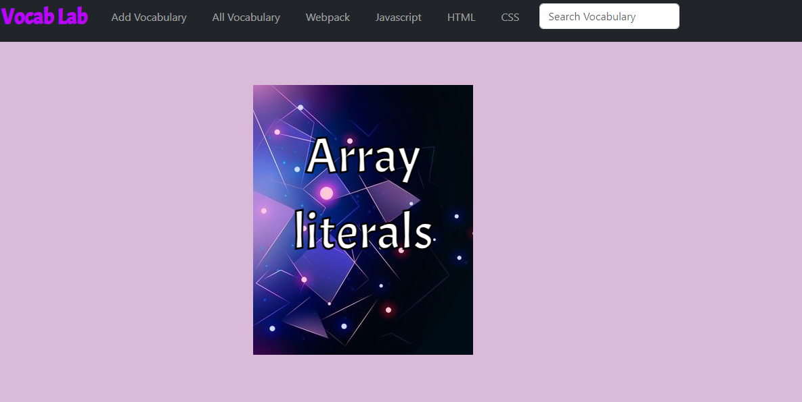

# Vocab Lab  

Here I am putting an overview of what my project is about. It comes below the name of my project so that others can read what it is about and get more details.

[View App](#https://johnnysaniat-vocabularycards.netlify.app/)
## About the User 
- The ideal user for this application is someone wishing to create vocabulary cards to test their knowledge
- They have a list of terms that they should have memorized for future utilization 

## Features
- Firebase integration
- Navigation bar that allows a user to add vocabulary, sort vocabulary by All, sort vocabulary by Webpack, sort vocabulary by Javascript, sort vocabulary by HTML, sort vocabulary by CSS, that can all be searched using a search bar
- Vocabulary cards are able to be deleted, edited, and studied
- When a user clicks the study button a card appers with the vocab term with a hover function that flips the card to reveal the definition

## Video Walkthrough of Vocab Lab
https://www.loom.com/share/be5c17b97b314062915c923e83e7ad28?sid=b68caf40-c98d-4d8b-9d64-3828ae1be1f2

## Relevant Links <!-- Link to all the things that are required outside of the ones that have their own section -->
- [Check out the deployed site](#https://johnnysaniat-vocabularycards.netlify.app/)
- [Project Board](#https://excalidraw.com/#json=AHYo_uEYWzVyr5MU1czIM,RS_DJ4GrW8bkxP47q24dSw)
- [Folder Design](#https://dbdiagram.io/d/64f3533f02bd1c4a5ed9e906)

## Project Screenshots

## Contributors
- [Johnny Saniat](https://github.com/JohnnySaniat)
